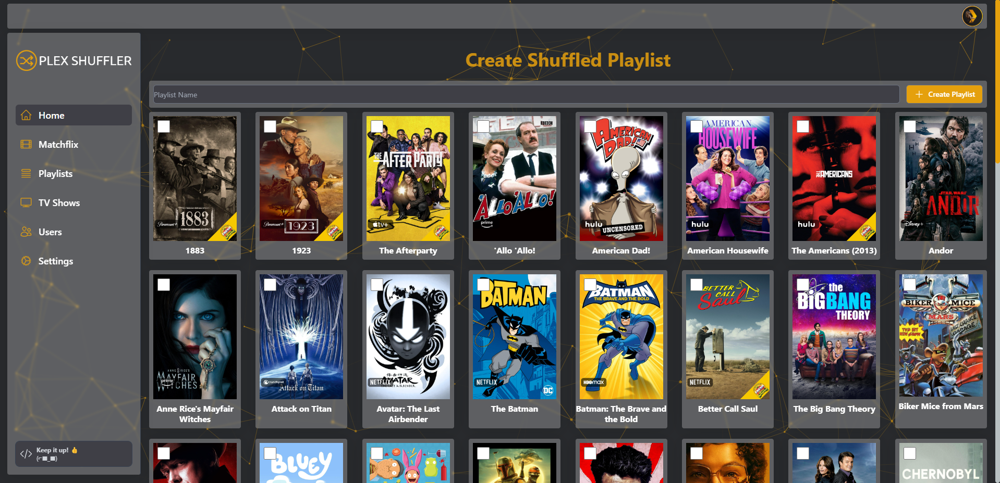
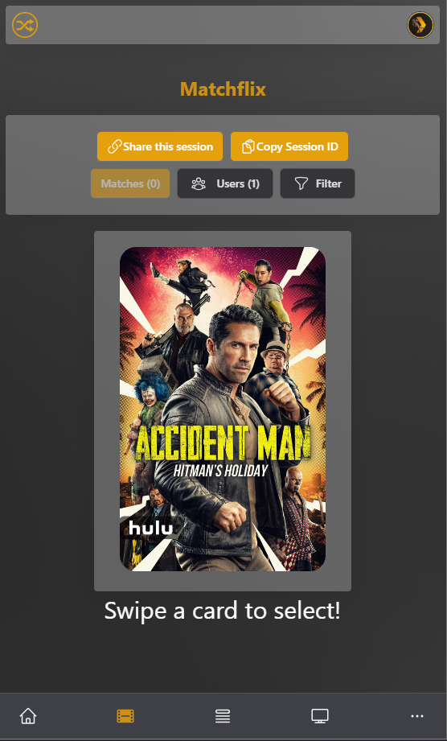

<p align="center">

</p>
<p align="center">


<a href="https://hub.docker.com/r/douwjacobs/plex-shuffler"></a>
<a href="https://github.com/DouwJacobs/plex-shuffler/tags"></a>
</p>
<p align="center">
<a href="https://github.com/DouwJacobs/plex-shuffler/blob/development/LICENSE"></a>

**Plex Shuffler** is a free and open source software application for creating shuffled playlists on Plex. It integrates with **[Plex](https://www.plex.tv/)** and allows the user to shuffle different TV shows but keep a single TV show's episodes in order. The idea is to create a TV channel-like experience by shuffling your favorite TV shows.

<br>

## Current Features

- Create shuffled playlists from shows on your Plex server.
- Full Plex integration. Authenticate and manage user access with Plex!
- Can view available Plex playlists.
- Browse available TV shows.

<br>

## Getting Started

Check out our documentation for instructions on how to install and run Plex Shuffler:

https://plex-shuffler.gitbook.io/plex-shuffler/getting-started/installation

<br>

## Preview



<br>

## What does Plex Shuffler do?

Plex Shuffler creates shuffled playlists based on TV shows that the user selects. The shuffled playlist gives the user a TV channel-like experience. This is useful if you don't know what to watch but still want to follow the episodes sequentially.

**So how does this work?**

If the user selects three different TV shows the playlist will look something like this

```
    TV Show 1 - Episode 1
    TV Show 2 - Episode 1
    TV Show 1 - Episode 2
    TV Show 3 - Episode 1
    TV Show 2 - Episode 2
    TV Show 3 - Episode 2
    TV Show 1 - Episode 3
```

You will have a shuffled playlist of your (favorite) shows but the episode ordering for each show will follow sequentially!

No more nights of deciding what to watch or getting bored of the same old show!

<br>

## Matchflix

Matchflix is a component of Plex Shuffler. Its like Tinder for movies or TV shows.

Matchflix can be used to facilitate group decision-making when it comes to choosing a movie or TV show to watch.

- Group Creation: Users have the option to create or join groups within the Matchflix component. These groups can be comprised of anyone on the Plex server who want to make collective decisions on what to watch.

- Swiping and Voting: Within the group, a designated organizer user can initiate the decision-making process. They can create a "group session" where members can participate by swiping left or right on movie or TV show options. Each member of the group will have the opportunity to vote on their preferences.

- Matching and Filtering: Once there are more than 2 users in the session users can start swiping left or right on content. When all users swipe right on a specific movie or TV show a "matches" button will appear. Users can then decide to either continue swiping or click the "matches" button to see movies or TV shows that all users selected.

- Group Recommendations: Matchflix generates a list of recommended movies or TV shows based on the initial user's filters.

<div align="center"></div>

<br>

## Planned Features

- Easily manage all playlists from one place.
- Create a "marketplace" where users can share their shuffled playlists with other users on the server.

<br>

## API Documentation

API documentation can be viewed at http://localhost:3210/api-docs

<br>

## Alpha Development

> **Warning**
> Please be advised that Plex Shuffler is currently undergoing active development and may exhibit unpredictable behavior or encounter occasional issues. We urge you to exercise caution and take the following precautions while using the application:

1. Backup your Media Library: Prior to utilizing Plex Shuffler, ensure that you have a comprehensive backup of your media collection. This precaution will help safeguard your valuable content in case of any unforeseen problems during the shuffling process.

2. Regularly Check for Updates: As development progresses, updates and bug fixes will be released to enhance the stability and reliability of Plex Shuffler. Make it a habit to regularly check for updates and install them promptly to ensure you have the latest improvements and fixes.

3. Provide Feedback and Report Issues: If you encounter any issues, inconsistencies, or unexpected behavior while using Plex Shuffler, we encourage you to report them to the development team. Your feedback is invaluable in helping us refine the application and address potential problems more effectively.

4. Exercise Caution: While using Plex Shuffler, exercise caution and be aware that the shuffling algorithm is still being refined. Although efforts are being made to ensure the best possible experience, it is crucial to keep in mind that unexpected outcomes or unintended changes to your media organization may occur.

We appreciate your understanding and patience as we work towards enhancing the functionality and stability of Plex Shuffler. Your participation in this active development phase contributes significantly to the evolution of the application.

Should you have any questions or require further assistance, please consult the official Plex Shuffler documentation or seek support from the designated channels.

Thank you for your cooperation and happy shuffling!
